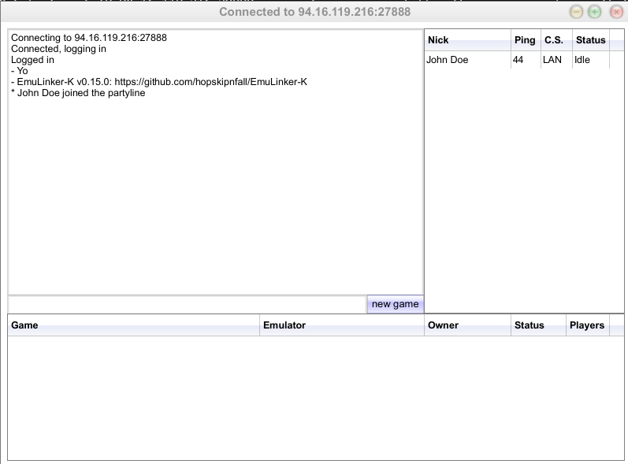
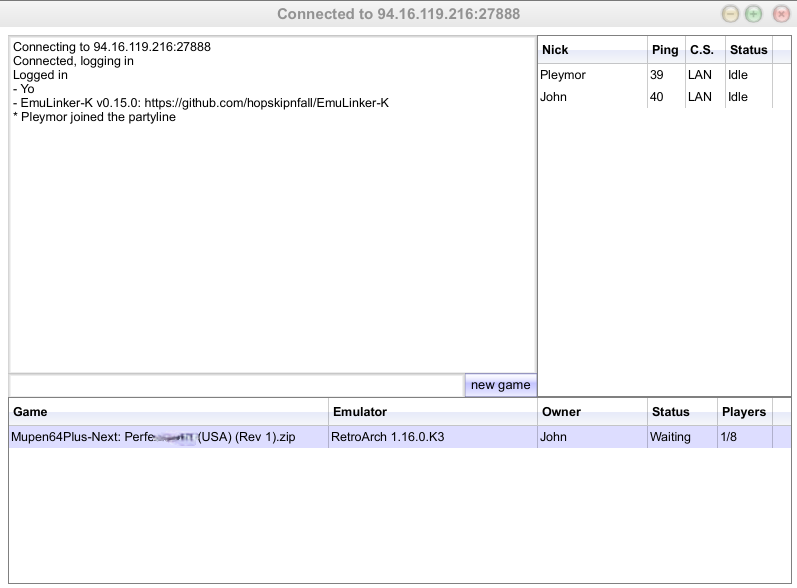

![Maintained][maintained-badge]
[](https://github.com/hopskipnfall/EmuLinker-K/actions/workflows/gradle.yml)
[](https://crowdin.com/project/emulinker-k)

[![Watch on GitHub][github-watch-badge]][github-watch]
[![Star on GitHub][github-star-badge]][github-star]
[![Tweet][twitter-badge]][twitter]

# EmuLinker-K

EmuLinker-K (ELK) is a server that uses the Kaillera protocol to facilitate online multiplayer for emulators.

EmuLinker-K is a Kotlin rewrite of [EmulinkerSF](https://github.com/God-Weapon/EmuLinkerSF), with an emphasis on measuring and improving performance, patching security and privacy vulnerabilities, and adding useful features for both server owners and users.  EmuLinker-K is maintained by [nue](https://twitter.com/6kRt62r2zvKp5Rh).

Please help us translate the server into more languages by contributing to our [CrowdIn project](https://crowdin.com/project/emulinker-k)

Feel free to file bugs and feature requests on this repository, or find our channel in the Kaillera Reborn discord:

[](https://discord.gg/MqZEph388c)

## Setting up a new server

### Prerequisites

Ensure Java 17 is installed.

On Debian/Ubuntu:

```bash
java --version
```

If Java 17 is not installed, then run

```bash
sudo apt update
sudo apt install openjdk-17-jdk openjdk-17-jre
```

Ensure unzip is installed.

```bash
sudo apt install unzip
```

### Installation of the server

Download the latest version from the [Releases](https://github.com/hopskipnfall/EmuLinker-K/releases/latest) page.


Copy the link of the .zip in the page linked above, then download it.

On Debian/ubuntu:

```bash
wget https://github.com/hopskipnfall/EmuLinker-K/releases/download/0.15/EmuLinker-K-0.15.0.zip
```

Unzip it.

On Debian/ubuntu:

```bash
unzip EmuLinker-K-0.15.0.zip
```

Go to `EmuLinker-K` folder.

```bash
cd EmuLinker-K/
```

1. Allow scripts to be executed:

```bash
chmod +x *.sh
```

2. Configure your server

Configure at least the name which will appear in Kaillera clients:

```bash
nano conf/emulinker.cfg
```

```ini
 # MASTER LIST CONFIGURATION
 # =========================
 # Server name to display in the master lists
masterList.serverName=John Doe Server
 # Location of the server to display in the master lists
masterList.serverLocation=Chateauneuf-du-Faou
```

3. Run the server

Option 1 - deamon mode (will remain open as long as you don't restart your machine)

```bash
./start-server.sh
```

Option 2 - simple mode (will be closed if you close the process).

This option may be preferable if you don't want to let your server open after your game session.

```bash
./server.sh
```

The server should now be running on port `27888`.

If your server is installed on a VPS, open the port.

On Debian/Ubuntu, if ufw is installed to managed ports (recommended):

```bash
sudo ufw allow 27888
```

## Running a game

The best way to know if your server is running as expected is to run a game.

Here is an example of how to run a N64 game (remember you are not allowed to run emulated game unless you possess an original one).

To do on ALL the PCs: 

1. Download and unzip [RetroaArch with Kaillera support](https://kaillerareborn.github.io/)
2. Run `retroarch.exe` (execute anyway if Windows displays a warning)
3. Load a core > Download a core > Select your favorite emulator
4. Configure your controller 1 if needed (it's the one used in Netplay even if you are not the 1st player)
5. Download the rom you want to play (must be the same on all PCs)
6. Run it once in Retroarch (Load content > browse to your rom file)
7. From Retroarch main menu, click on "Kaillera Netplay"
8. Click on "Add"
8. Set the name you want and enter the IP to the server's one followed by the port (example `123.456.78.90:27888`)
9. Validate with "Add", and the server should now appear in your favorites

Once done on all PCs, the player 1 must, ALONE:
* connect to the server

He should see something like this:


* Click on "new game" > if "no games in list", close kaillera client, run your game once, close the game, then try again.
* DO NOT start the game YET

Now, all the other players can connect to the server.
* Instead of clicking on "new game", they will join the player 1 by double-clicking on the line


Once everyone is here, the 1st player can click on "Start".

Enjoy!

## Features

### Experimental/beta features

These features may be removed or changed without warning.

#### Twitter integration

You can have the server make a Twitter post when a user opens a game, and either delete it or reply marking it as "closed" when the game starts. At the time of writing this, both options are supported by the Twitter API free tier.


To set it up, configure the following values in `config/emulinker.cfg`:

```
# Twitter reporting integration switch. When enabled it will
# broadcast new open games.
twitter.enabled=true

# Delay (in seconds) before sending a tweet.
twitter.broadcastDelaySeconds=20

# Comma-separated list of phrases that, if found in the name
# after a "@", will prevent tweet posting.
# Example username: nue@waiting
twitter.preventBroadcastNameSuffixes=waiting,restart
# If true, will simply delete the tweet when the game starts.
twitter.deletePostOnClose=false

# You will need to make a new Twitter API app and fill in these values.
twitter.auth.oAuthAccessToken=
twitter.auth.oAuthAccessTokenSecret=
twitter.auth.oAuthConsumerKey=
twitter.auth.oAuthConsumerSecret=
```

You will also need to configure some messages in `config/language.properties`:

```
KailleraServerImpl.TweetPendingAnnouncement=Posting a tweet in {0} seconds. Type \"/stop\" to disable.
KailleraServerImpl.TweetCloseMessage=(opponent found)
KailleraServerImpl.CanceledPendingTweet=Canceled pending tweet.
```

With these settings, users whose name ends in @waiting (meaning they are waiting for a specific person to join their game) or @restart (meaning they are restarting the game and are waiting for the same person to join) will not have tweets sent. Similarly, users will be notified and given 20 seconds to type `/stop` to stop the tweet from sending.  After the game starts, the account will respond to the original tweet with the text "(opponent found)".

## Configuration files

### emulinker.cfg

Here is a full list of supported options to set in emulinker.cfg:

| Config Key                              | Default Value  | Description                                                                                                                                                                                                                                                                                                                                                            |
|-----------------------------------------|----------------|------------------------------------------------------------------------------------------------------------------------------------------------------------------------------------------------------------------------------------------------------------------------------------------------------------------------------------------------------------------------|
| controllers.connect.port                | 27888          | The port used by the server for all communication. Most clients will default to 27888 as the default.                                                                                                                                                                                                                                                                  |
| controllers.v086.bufferSize             | 4096           | Buffer size for v086 protocol in bytes.                                                                                                                                                                                                                                                                                                                                |
| controllers.v086.clientTypes.clientType |                | Comma-separated list of accepted protocols. This should be set to 0.83.                                                                                                                                                                                                                                                                                                |
| emulinker.charset                       | (required)     | The charset name used most commonly by your clients. If set incorrectly, some characters will not display as expected.<br/>Common values: English: Cp1252, Cyrillic: Cp1251; Korean: Cp949, Japanese: Shift_JIS<br/>https://www.iana.org/assignments/character-sets/character-sets.xhtml<br/>Do not use UTF-8 unless your clients support it (most if not all do not). |
| game.bufferSize                         | (required)     | Buffer size for the game data queue.  Increasing this will not improve performance. Should be equal to at least the largest single game packet.                                                                                                                                                                                                                        |
| game.defaultAutoFireSensitivity         | 0              | Auto-fire sensitivity. 0 (disabled) through 5 (maximum sensitivity)                                                                                                                                                                                                                                                                                                    |
| masterList.serverConnectAddress         |                | Server address for master list registration                                                                                                                                                                                                                                                                                                                            |
| masterList.serverLocation               | Unknown        | Server location for master list display                                                                                                                                                                                                                                                                                                                                |
| masterList.serverName                   | New ELK Server | Name used to identify the server                                                                                                                                                                                                                                                                                                                                       |
| masterList.serverWebsite                |                | Server website URL for master list                                                                                                                                                                                                                                                                                                                                     |
| masterList.touchEmulinker               | FALSE          | Registers server with the EmuLinker master list                                                                                                                                                                                                                                                                                                                        |
| masterList.touchKaillera                | FALSE          | Registers server with the Kaillera master list                                                                                                                                                                                                                                                                                                                         |
| metrics.enabled                         | FALSE          | Enables detailed monitoring of server health                                                                                                                                                                                                                                                                                                                           |
| metrics.loggingFrequencySeconds         | 30             | How frequently to log aggregated metrics for debugging                                                                                                                                                                                                                                                                                                                 |
| server.allowedConnectionTypes           | 1,2,3,4,5,6    | Comma-separated list of allowed connection types by their ID (1 = LAN, 2 = Excellent, 3 = Good, 4 = Average, 5 = Low, 6 =  Bad)                                                                                                                                                                                                                                        |
| server.allowMultipleConnections         | TRUE           | Controls whether a single IP address can be logged in multiple times at the same time                                                                                                                                                                                                                                                                                  |
| server.allowSinglePlayer                | TRUE           | Whether users are allowed to start a game when no other users have joined                                                                                                                                                                                                                                                                                              |
| server.chatFloodTime                    | 2              | Minimimum time (in seconds) a user must wait between sending two chat messages                                                                                                                                                                                                                                                                                         |
| server.coreThreadpoolSize               | 5              | Core size of the thread pool for user actions.                                                                                                                                                                                                                                                                                                                         |
| server.createGameFloodTime              | 2              | Minimum time (in seconds) a user must wait between creating two games                                                                                                                                                                                                                                                                                                  |
| server.idleTimeout                      | 3600           | How often a user must engage in the server before being kicked for inactivity (0 to disable)                                                                                                                                                                                                                                                                           |
| server.keepAliveTimeout                 | 190            | Amount of time (in seconds) the server will wait before deciding a client has disconnected. Note: This is not related to user inactivity                                                                                                                                                                                                                               |
| server.lagstatDurationSeconds           | 60             | Duration for lag statistics collection in seconds. This is under active development, please give feedback in the discord instead of overriding this value.                                                                                                                                                                                                             |
| server.maxChatLength                    | 150            | Maximum length of chat messages (0 to disable)                                                                                                                                                                                                                                                                                                                         |
| server.maxClientNameLength              | 127            | Maximum length of the kaillera client name (must be less ≤ 127)                                                                                                                                                                                                                                                                                                        |
| server.maxGameChatLength                | 320            | Maximum length of game chat messages                                                                                                                                                                                                                                                                                                                                   |
| server.maxGameNameLength                | 127            | Maximum length of a game name (must be ≤ 127)                                                                                                                                                                                                                                                                                                                          |
| server.maxGames                         | 0              | Maximum number of games that can be created in the server simultaneously (0 to disable)                                                                                                                                                                                                                                                                                |
| server.maxPing                          | 1000           | Maximum allowed roundtrip ping in milliseconds (must be ≤ 1000)                                                                                                                                                                                                                                                                                                        |
| server.maxQuitMessageLength             | 100            | Maximum length of quit messages                                                                                                                                                                                                                                                                                                                                        |
| server.maxUserNameLength                | 30             | Maximum length of user names (must be ≤ 31)                                                                                                                                                                                                                                                                                                                            |
| server.maxUsers                         | 0              | Maximum number of concurrent users logged into the server (0 to disable)                                                                                                                                                                                                                                                                                               |
| server.nettyThreadpoolSize              | 30             | Number of Netty threads in the thread pool                                                                                                                                                                                                                                                                                                                             |
| server.switchStatusBytesForBuggyClient  | FALSE          | Switch some game/player statuses for a Japanese client "Project 64k 0.13 (01 Aug 2003)" that seems to use different values.                                                                                                                                                                                                                                            |
| twitter.auth.oAuthAccessToken           |                | Twitter OAuth access token                                                                                                                                                                                                                                                                                                                                             |
| twitter.auth.oAuthAccessTokenSecret     |                | Twitter OAuth access token secret                                                                                                                                                                                                                                                                                                                                      |
| twitter.auth.oAuthConsumerKey           |                | Twitter OAuth consumer key                                                                                                                                                                                                                                                                                                                                             |
| twitter.auth.oAuthConsumerSecret        |                | Twitter OAuth consumer secret                                                                                                                                                                                                                                                                                                                                          |
| twitter.broadcastDelaySeconds           | 15             | Delay from starting a game to when the tweet is posted                                                                                                                                                                                                                                                                                                                 |
| twitter.deletePostOnClose               | FALSE          | Whether to delete Twitter posts when games close                                                                                                                                                                                                                                                                                                                       |
| twitter.enabled                         | FALSE          | Enable posting to twitter based on game activity                                                                                                                                                                                                                                                                                                                       |
| twitter.preventBroadcastNameSuffixes    |                | Comma-separated list of name suffixes appearing after a @ in the username to prevent posting to twitter                                                                                                                                                                                                                                                                |

## Contributing

If you're interested in contributing to this project, please read [Contributing.md](CONTRIBUTING.md).

[prs-badge]: https://img.shields.io/badge/PRs-welcome-brightgreen.svg?style=flat-square
[prs]: http://makeapullrequest.com
[github-watch-badge]: https://img.shields.io/github/watchers/hopskipnfall/EmuLinker-K.svg?style=social
[github-watch]: https://github.com/hopskipnfall/EmuLinker-K/watchers
[github-star-badge]: https://img.shields.io/github/stars/hopskipnfall/EmuLinker-K.svg?style=social
[github-star]: https://github.com/hopskipnfall/EmuLinker-K/stargazers
[twitter]: https://twitter.com/intent/tweet?text=https://github.com/hopskipnfall/EmuLinker-K%20%F0%9F%91%8D
[twitter-badge]: https://img.shields.io/twitter/url/https/github.com/hopskipnfall/EmuLinker-K.svg?style=social
[maintained-badge]: https://img.shields.io/badge/maintained-yes-brightgreen
